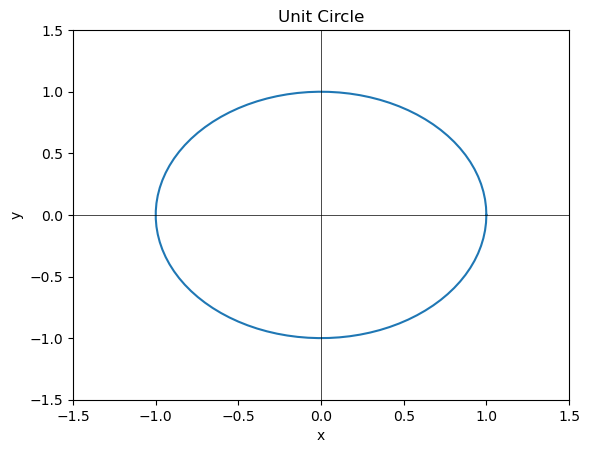
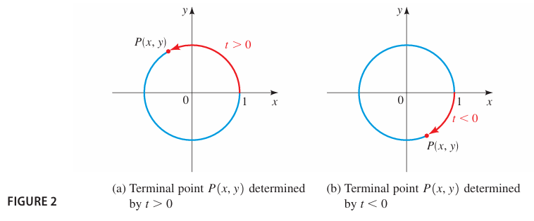
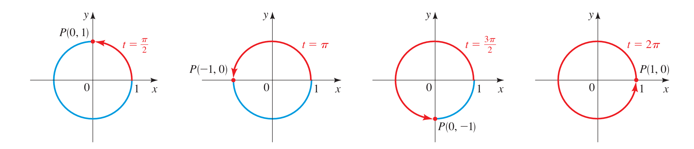

# 5-1 The Unit Circle

In this section we explore some properties of the circle of rarius 1 centered at the origin. These properties are used in the next section to define the trigonometric functions.

## The Unit Circle

The set of points at a distance 1 from the origin is a circle of radius 1 (see Figure 1). In Section 1.9 we learned that the equation of this circle is $\ x^2 + y^2 = 1$.

> **THE UNIT CIRCLE**:   The **unit circle** it the circle of raidus 1 centered at the origin in the $\ xy-$ plane. Its equation is $\ x^2 + y^2 = 1$

### Example 1: A Point on the Unit Circle

Show that the point $\ P \left( \frac{\sqrt3}{3}, \frac{\sqrt6}{6} \right)$ is on the unit circle.

> Solution  
We need to show that this point satisfies the equation of the unit circle, that is, $\ x^2 + y^2 = 1 $. Since  
$\ \left( \frac{\sqrt3}{3} \right)^2 + \left( \frac{\sqrt6}{3} \right)^2 = \frac{3}{9} + \frac{6}{9} = 1$  
P is on the unit circle

### EXAMPLE 2: Locating a Point on the Unit Circle

The point $\ P(\sqrt3/2, y) $ is on the unit circle in Quadrant IV. Find its y-coordinate.

> SOLUTION: Since the point is on the unit circle, we have  
$\ \left( \frac{\sqrt{3}}{2}\right)^2 + y^2 = 1 $  
$\ y^2 = 1 - \frac{3}{4} = \frac{1}{4}$ 
$\ y = +- \frac{1}{2}$ 
Since the point is in Quadrant IV, its y-coordinate msut be negative, so $\ y = \frac{-1}{2}$

## Terminal Points on the Unit Circle

Suppose $t$  is a real number. If $ t \geq 0$, let's mark off a distance $ t$ along the unit circle, starting at the point $ (1, 0)$ and moving in a counterclockwise direction. If $ t < 0$ we mark off a distance $ \lvert t \rvert$ in a clockwise direction (Figure 2). In this way we arrive at a point $ P(x, y)$ on the unit circle. The point $ P(x, y) $ obtained in this way is called the **terminal point** determined by the real number $t$.

The circumference of the unit circle is $ C = 2\pi (1) = 2\pi$. So if a point starts at $(1, 0)$ and moves counterclockwise all the way around the unit circle and returns to $ (1, 0)$, it travels a distance of $2\pi$. To move halfway around the circle, it travels a distance of $\frac{1}{2}(2\pi) = \pi$. To move a quarter of the distance around the circle, it travels a distance of $ \frac{1}{4}(2\pi) = \frac{\pi}{2}$. Where does the point end up when it travels these distances along the circle? From figure 3 we see, for example, that when it travels a distance of $\pi$ starting at $(1, 0)$, its terminal point is $(-1,0)$.

